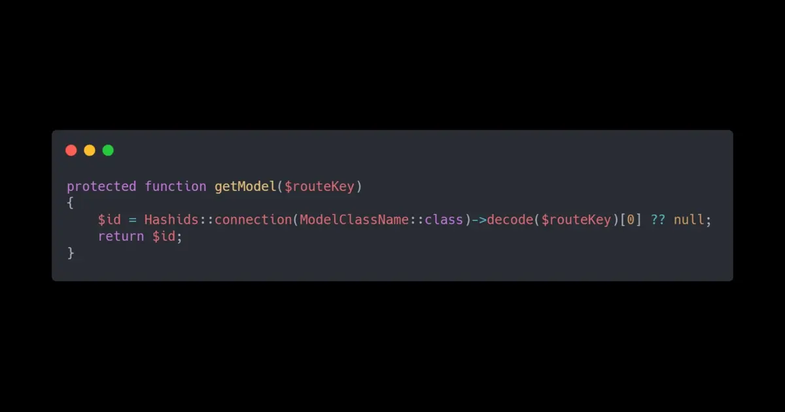

Sometime we are tend to mistakes because we are too busy or simple just ignore. sometime we don't want to break things that actually works fine and perfect. as web developer we are creating URL as we like to give a sense to user where are they and where they came from. so we don't care to show the id or particular item related thing in the URL.

> It works fine, why do i have to change it

yes, it fine by me too but why do we want show a direct database connection related thing to user. you don't have to do that. when there are so many data, it works fine most of the time.

## Platform

Oh shit, I forgot to mention about the awesome thing. A platform written on top of [Laravel](https://laravel.com/) called [Orchid platform](https://orchid.software/en/). it is amazing to work with and lesser configuration; you can start a web application with admin panel. there are tones of feature and contain 40+ form elements to be used. those are production ready and uses minor configuration to get things done.

## What is Hash ID

Let get back to the path again. what it [Hashid](https://hashids.org/). we are using MySQL or what ever other databases for data storing when we reterving data, we just get and throw at frontend with exact number in the URL too. also, it can lead to security issues too. why do we want to be vulnerable. so simple solution is very simple. use something called hashid. it is something that convert id digit or string to very complicated thing and it is required a key to unhash it. simple word, you will able to get a URL like YouTube video URL. open source community has written several libraries for based on language you prefers. you like it right? ok then let dive in to the trouble part.

the issue was, when you search for Laravel. there are ways to make it happen but for Orchid thing, there is any to find. so it says you need to decode it in the route. you need to do the initial configuration like updating hashid configuration with key and number of character that is required.

So after that, it is required update the **getModel** function in the model

this need to written in the model class. This because Orchids use different strategy for to help it UI implementation. it uses CLI command to create and link view and screen with UI elements. What happens here is, we are decoding the model key before it runs the database query to get the data. So by that you can send the exact number to the database query where it is defined in query section in screen view of Orchid platform.

So via thing change, it can be achieved the HashId concept to your URL and you can have different key values in order to make different id value for same Id value on different entities on your application.
