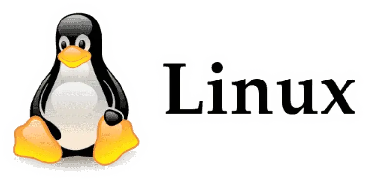
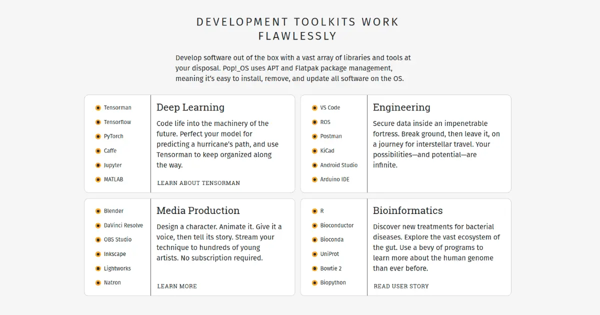

It's been a while I didn't write up. I had some bumps down the line to fix and am now back on track. While I was away, several amazing things happen in the world.
I may be a little bit lagging now, I need to catch up on things ASAP.

TL;DR. Away for a little and back.

While back, I was looking for a Linux distro to suit me because I used to work with Mac.
It was sort of easy to use even though there are few features I don't like. I am not continuing my writing about it.
People can argue about it their options and I respect it. I am talking about my experience in usage.

## How it started

At most, I should tell you guy how I started using Linux. My hand on for the first time on Linux was mail, not via torrent or download.
We had to submit our home address, and ubuntu would send you three 3 CDs with Desktop, Server, and KDE versions(as I remember, pardon me if I am wrong).

Unfortunately, [they stopped it after some time](https://ubuntu.com/posts/shipit-comes-to-an-end). It was a new experience for us while we were using Windows versions.
Didn't fall in love with first, but I had to. Because it's free(Just kidding), and you can unleash anything you wanted.

## The Journey

While you are using something, the inevitable thing happens for everything.
You will start looking for new things, which is the best, best performer for your laptop, and many other things.
At that time, there were so many options to select. I will list down some I have tried. All of those are awesome Linux distros.
I was looking for something, and I wasn't able to find it in those in them.

1. [Ubuntu](https://ubuntu.com/) 
   My first ever hands-on experience in the Linux world came in the mail, not via the internet. First, it was hard to learn. When you fiddle with it, you will get used to it.

2. [Linux Mint](https://linuxmint.com/) 
   After I used Ubuntu, this was my replacement for Ubuntu. Experience-wise, it is a great Linux system, and lots of people are using this.

3. [Red Hat Linux](https://www.redhat.com/en/technologies/linux-platforms/enterprise-linux) 
   Yes, I have used it for some time. It was an unlike experience because some features are a bit different.

4. [Fedora](https://getfedora.org/) 
   This one is amazing to use. It was built for developers mostly and help you to do so many things. I especially like the GUI they have designed.

5. [Elementary OS](https://elementary.io/) 
   Fancy one to use but a great alternative to Windows and Mac OS. If you check their official website and you will be able to see what I am telling you.

6. [Tails](https://tails.boum.org/) 
   Sometimes, you feel like you are insecure about this internet thing. You can reference something like this if you care about your privacy more. There are cases you will need this, so read the docs.

## What I have ended up with

I have been using all of these Linux versions, and I was feel like something is missing.
I started searching for it even though I didn't found a proper answer.
I was referring to both the personal and work world. S
uddenly, I stuck with an article twittered in [hacker news](https://news.ycombinator.com/) [Twitter account](https://twitter.com/newsycombinator?lang=en).

It has developed by group name [System76](https://system76.com/about). They have produced amazing stuff for the world in addition to this OS. They have named it with [Pop!\_OS
](https://pop.system76.com/). They have developed it in a way to target the software developers and to use their OS productively. Features are awesome to use those you need to remember some keystrokes.

## Features, I liked

- Windows stacking option

You can enable windows stacking, which is a handy option when you are working on several things at once. Windows has this option, but not in a way they have implemented. The stack option can be enabled and disabled based on your preference. After some time, I got annoyed with the stacking option and stopped using it. It is a great feature to use if you do like it.
More keyboard shortcuts

Less touchpad interaction is the key to more productivity. You can do so many things with the keyboard rather than tapping the touchpad. Lots of developers use Vim as their editor, they don't have to touch the keyboard. There is a shortcut for everything you can do. There are plugins to configure your [VSCode as Vim](https://marketplace.visualstudio.com/items?itemName=vscodevim.vim). So, Pop offers that flexibility to you.

- Fingers gestures

With [latest version Cosmic](https://blog.system76.com/post/655369428109869056/popos-2104-a-release-of-cosmic-proportions), it offers you cool touchpad gestures to navigate through your workspaces. It's a pretty cool thing, Its works like a charm.

1. Swipe four fingers right on the trackpad to open the Applications view
2. Swipe four fingers left to open the Workspaces view
3. Swipe four fingers up or down to switch to another workspace
4. Swipe with three fingers to switch between open windows

## Conclusion

There are a few issues with it. Sometimes my Bluetooth connection gets haywire. I don't whether it's an OS issue or my hardware issue. I didn't care about it. It's open-source, there can be issues.

Anyway, It's a pretty cool Linux distro use as a developer. Out of the box, it supports lots of thing developer wanted. No, harm in trying it. If you don't like it, you can keep search and find one.

Until next time, see you, folks👏.
