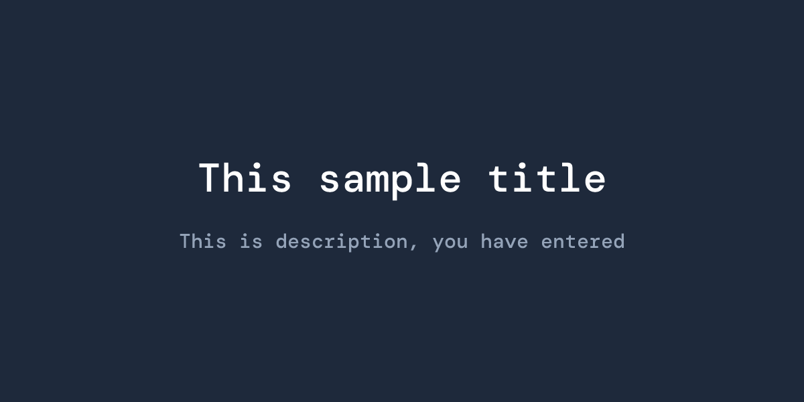

Open Graph (OG) images are essential for making your content stand out when shared on social media. In this guide, we'll explore how to generate dynamic OG images in Astro using Vercel's **[@vercel/og](https://vercel.com/docs/og-image-generation/og-image-api)** package.

## Why Dynamic OG Images?

Dynamic OG images offer several advantages:

- **Personalization**: Generate unique images for each page or blog post
- **Consistency**: Maintain brand identity across all shared content
- **Efficiency**: No need to manually create images for every page
- **Real-time updates**: Images reflect the latest content automatically

## Setting Up the Project

First, install the required package: (its's depend on your package manager)

```bash
npm install @vercel/og
```

The `@vercel/og` package uses Satori under the hood to convert HTML and CSS into images. It's optimized for edge runtimes and works seamlessly with Astro's server-side rendering.

## Creating an API Endpoint

Astro supports API routes that can return non-HTML responses. We'll create an endpoint that generates OG images on demand.
**You need to find the page rendering your blog post. It would be something like below, but it will change depend on your folder structure.**

Create a file at `src/pages/blog/[slug]/og.png.ts`:

```typescript
import { getCollection, type CollectionEntry } from "astro:content";
import { ImageResponse } from "@vercel/og";

interface Props {
  params: { slug: string };
  props: { post: CollectionEntry<"post"> };
}

export async function GET({ props, params }: Props) {
  const { post } = props;
  const { slug } = params;

  if (!slug) {
    return new Response("Slug parameter is required", { status: 400 });
  }

  const title = post.data.title;
  const description = post.data.description;

  const html = {
    type: 'div',
    props: {
      style: {
        height: '100%',
        width: '100%',
        display: 'flex',
        flexDirection: 'column',
        alignItems: 'center',
        justifyContent: 'center',
        backgroundColor: '#1e293b',
        padding: '40px 80px',
      },
      children: [
        {
          type: 'h1',
          props: {
            style: {
              fontSize: '60px',
              fontWeight: 'bold',
              color: '#ffffff',
              marginBottom: '20px',
              textAlign: 'center',
            },
            children: title,
          },
        },
        description && {
          type: 'p',
          props: {
            style: {
              fontSize: '30px',
              color: '#94a3b8',
              textAlign: 'center',
            },
            children: description,
          },
        },
      ].filter(Boolean),
    },
  };

  return new ImageResponse(html, {
    width: 1200,
    height: 630,
  });
};

export async function getStaticPaths() {
  const blogPosts = await getCollection("post");
  return blogPosts.map((post) => ({
    params: { slug: post.id },
    props: { post },
  }));
}

```
This will render following OG image. You can see it by visiting `[youblogurl]/og.png`


## Understanding the Code

The endpoint accepts query parameters (`title` and `description`) and generates an image using JSX-like syntax. The `ImageResponse` constructor takes:

1. **HTML structure**: Written as nested objects representing HTML elements
2. **Options**: Including dimensions (1200x630 is the standard OG image size)

The styling uses Flexbox and is similar to React Native or inline CSS-in-JS.

## Using Custom Fonts

To use custom fonts, you'll need to load them as ArrayBuffer:

```typescript

return new ImageResponse(html, {
    width: 1200,
    height: 600,
    fonts: [
      {
        name: "DM Mono",
        data: await fs.readFileSync("./src/assets/fonts/DMMono-Medium.ttf"),
        style: "normal",
        weight: 700,
      },
      {
        name: "Space Grotesk",
        data: await fs.readFileSync(
          "./src/assets/fonts/SpaceGrotesk-Regular.otf"
        ),
        style: "normal",
        weight: 400,
      },
    ],
  });

```
After the import, you need to define the font weight and font in style section for each element or whole section.

## Using Images

You are required to use a specific way to add images for the OG according to [the documentation](https://vercel.com/docs/og-image-generation#runtime-support).

```typescript
  const postCover = await fs.promises.readFile(
    path.resolve("./src/assets/logo.png")
  );

```
## Adding OG Images to Your Pages

In your Astro page or layout, reference the generated image:

```astro
---
const title = "My Awesome Blog Post";
const description = "Learn how to build amazing things";
const ogImageUrl = `${slug}/og.png`;
---

<html>
  <head>
    <meta property="og:image" content={ogImageUrl} />
    <meta property="og:image:width" content="1200" />
    <meta property="og:image:height" content="630" />
    <meta name="twitter:card" content="summary_large_image" />
    <meta name="twitter:image" content={ogImageUrl} />
  </head>
  <body>
    <!-- Your content -->
  </body>
</html>
```

## Conclusion

Using Vercel's OG package with Astro provides a powerful, flexible way to generate dynamic Open Graph images. The approach is serverless-friendly, performant, and allows you to maintain consistent branding across all your shared content. With just a few lines of code, you can create professional-looking social media previews that adapt to your content automatically.